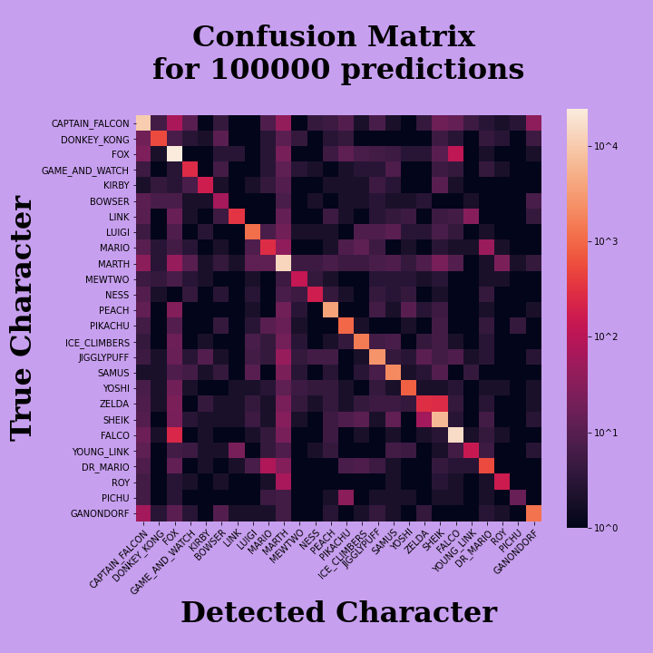

# SSBMachine Learning

***Super Smash Bros Machine Learning*** is a *Deep Learning* project
with the goal of detecting playstyle signatures in controller input signals.

The project was done in two parts:

- Part 1: ***Base Model***
  - Train a ***Convolutional Neural Network*** to predict the character choice of
    a player in a game of *Super Smash Bros Melee*, using only the raw input
    signal from that player's controller.
    
  - **Results:**

    ```
    Test accuracy: 97%
    Test top 8 accuracy: 99.6%
    ```

- Part 2: ***Transfer Model***

  - Use the previous model as a base and the method of ***Transfer Learning*** to train a
    *Transfer Model*, which will predict the *identity of a player* using only the raw
    input signal from that player's controller.
    
  - **Results in Part Two** 
    
## Context

In Esports and competitive online gaming, controller inputs are everything.
The best players in the world are the best because of the signals they can produce
with their hands and a small peice of plastic, and every player's unique playstyle ultimately
comes from a unique signature in that player's controller signal.

In a world where competition happens through a screen, it can be difficult to ensure fair play
by verifying that the competitors are who they say they are. However, what if we could make that
verification accurately with only the raw signal straight from a player's controller?
*Could we mitigate the negative impact of cheating and fraud in online games?*

## The Data

As a proof of concept, I decided to test the idea on *Super Smash Bros Melee* replay data.
I made this choice due to the ease use, the availability of good data, the challenging but
managable class balance, as well as my own familiarity with the game.


### Datasets

For ***Part 1: Character Classification*** the [Melee Public SLP Dataset](https://drive.google.com/file/d/1ab6ovA46tfiPZ2Y3a_yS1J3k3656yQ8f/view?usp=sharing) was used. This dataset is nearly 200G, includes just under ***100,000 full game replay files***, and is somewhat cleaned to ensure each game is an example of competitive tournament play.

For ***Part 2: Player Detection*** data was much more scarce. A handful of individual players from the [SSBM subreddit](https://www.reddit.com/r/SSBM) donated their own replay files to the project, and each player involved had on average only 1G worth of replay data available for analysis (compared to 200G for character detection). 

## Part 1: Character Detection
  
Use a Convolutional Neural Network to predict a player's character selection based on the raw input signal from that player's controller.

### Model

```
Model: "SSBML-Base-Model"
_________________________________________________________________
Layer (type)                 Output Shape              Param #   
=================================================================
ConvCell-1 (Sequential)      (None, None, 150)         59250     
_________________________________________________________________
ConvCell-2 (Sequential)      (None, None, 256)         577280    
_________________________________________________________________
ConvCell-3 (Sequential)      (None, None, 512)         1968640   
_________________________________________________________________
ConvCell-4 (Sequential)      (None, None, 512)         3932672   
_________________________________________________________________
global_average_pooling1d (Gl (None, 512)               0         
_________________________________________________________________
flatten (Flatten)            (None, 512)               0         
_________________________________________________________________
DenseCell-1 (Sequential)     (None, 128)               66176     
_________________________________________________________________
DenseCell-2 (Sequential)     (None, 128)               17024     
_________________________________________________________________
final (Dense)                (None, 26)                3354      
=================================================================
Total params: 6,624,396
Trainable params: 6,622,048
Non-trainable params: 2,348
_________________________________________________________________
```

### Training Data

SSBML-Base-Model was trained on just under ***825,000*** examples of Melee gameplay taken from the [Melee Public SLP Dataset](https://drive.google.com/file/d/1ab6ovA46tfiPZ2Y3a_yS1J3k3656yQ8f/view?usp=sharing). 

Each example is 1800 frames of input data; ***30 second clips of gameplay from one player.***

### Results

```
Test accuracy: 97%
Test top 8 accuracy: 99.6%
```

#### Confusion Matrix



NOTE: The heat map intensity is on a ***Log Scale*** to amplify noise. 

## Part 2: Player Detection

Use *Transfer Learning* to modify SSBML-Base-Model into a model that predicts *who* is holding the controller, based only on the raw inputs from that controller.

### Model

```
Model: "transfer_model"
_________________________________________________________________
Layer (type)                 Output Shape              Param #   
=================================================================
SSBML-Base-Model (Sequential (None, 512)               6537842   
_________________________________________________________________
head_dense64x2 (Sequential)  (None, 1)                 37569     
=================================================================
Total params: 6,575,411
Trainable params: 37,313
Non-trainable params: 6,538,098
_________________________________________________________________
```

### Training Data

Player detection models were trained on 30 second examples of gameplay from an individual player,
mixed with random examples from the public anonymous dataset.

While the character classification training dataset was close to 200G (before processing), 
individual players' datasets were typically closer to 1G.

### Results

---
#### Blynde

Test accuracy: **88%**

|	             | detected	      | not detected |
| -------      | -----------    | ---------    |
| present      |	0.461         |	0.059        |
| not present  |	0.065         |	0.415        |

---
#### gh0st

Test accuracy: **87%**
 
|	             | detected	     | not detected |
| -------      | -----------   | ---------    |
| present      |	0.510        |	0.050       |
| not present  |	0.065        |	0.375       |

---
#### SmashMaster9000

Test accuracy: **90%**

|	              | detected	    | not detected |
| -------       | -----------   | ---------    |
| present       |	0.407         |	0.033        |
| not present   |	0.062         |	0.498        |

---
#### ixwonkr

Test accuracy: **81%**

|	              | detected	    | not detected |
| -------       | -----------   | ---------    |
| present       |	0.431         |	0.129        |
| not present   |	0.079         |	0.361        |

---
#### Lie0x

Test accuracy: **80%**

|	              | detected	    | not detected |
| -------       | -----------   | ---------    |
| present       |	0.44          |	0.12         |
| not present   |	0.06          |	0.38         |

---
#### TCBL

Test accuracy: **81%**

|	              | detected	    | not detected |
| -------       | -----------   | ---------    |
| present       |	0.291         |	0.069        |
| not present   |	0.093         |	0.547        |
